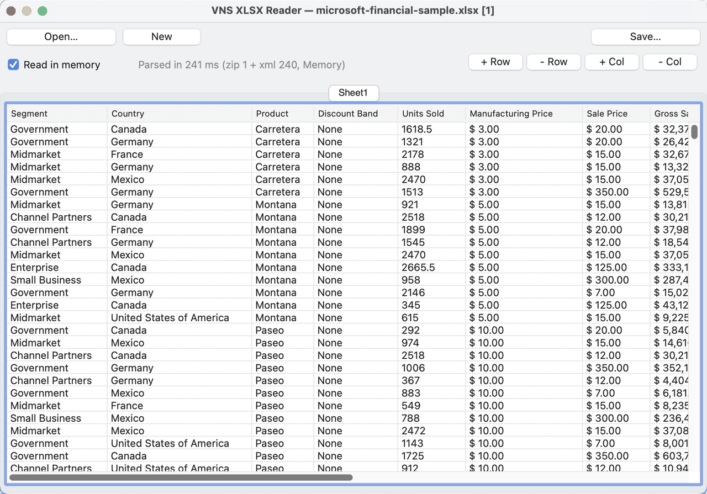
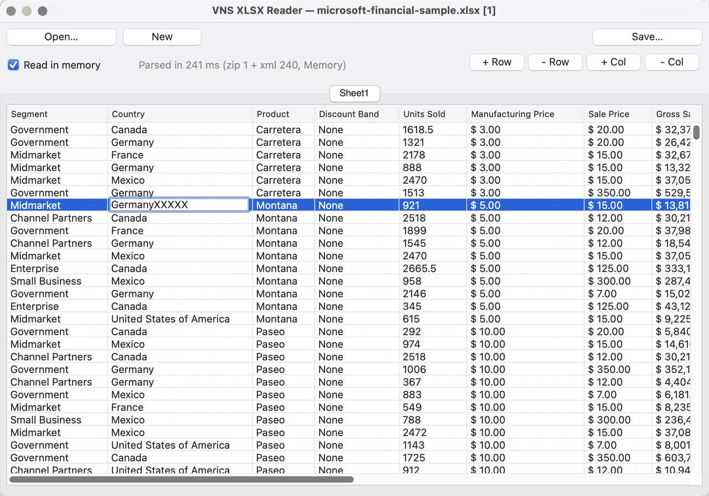
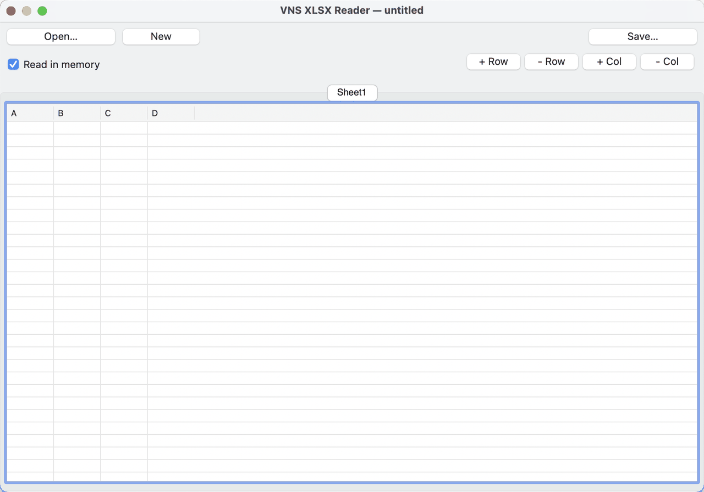
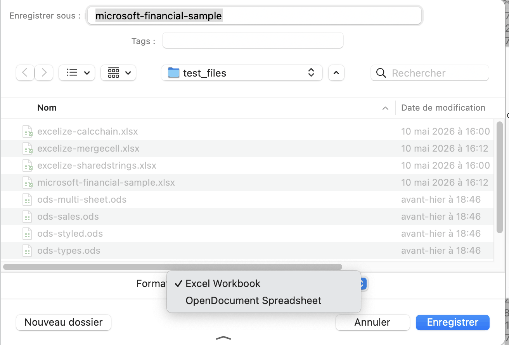

# VNS XLSX Reader

[](https://www.xojo.com)
[](version_history.md)
[]()
[](LICENSE)

> 💡 **Idea source:** this project grew out of the Xojo forum post [*Extracting xls/Excel file natively*](https://forum.xojo.com/t/extracting-xls-excel-file-natively/88210/1) — reading spreadsheet files with no plugins or third-party libraries.

A cross-platform `.xlsx` **and** `.ods` viewer written in **pure Xojo** (API 2.0, no plugins). Ships as a **Desktop** app for macOS / Windows / Linux and a **Web 2.0** browser app from the same shared parser.

Open any Excel or OpenDocument workbook → one tab per sheet → cell values rendered in a Listbox.

## Features

- 📂 **Open `.xlsx` and `.ods` files** via a native file dialog (Desktop) or browser upload (Web). One format-agnostic reader (`SpreadsheetReader`) picks the parser by extension.
- 📗 **OpenDocument (`.ods`) support** — the ODS reader parses `content.xml` into the same workbook model, converting OpenDocument `<number:*-style>` trees (date / number / currency / percentage) into the format codes the engine already understands.
- ✏️ **Edit cells in place** — click a cell to edit it; numeric input keeps the cell's type and number format (dates and currency re-render formatted), text becomes a string cell.
- 🆕 **Create a sheet from scratch** — the **New** button opens an empty editable grid, and **+ Row / − Row / + Col / − Col** buttons grow or shrink the sheet (they work on opened files too). Save it as `.xlsx` or `.ods` like any workbook.
- 💾 **Save / export to `.xlsx` AND `.ods`** — from either app, in either format (full cross-format conversion). Desktop uses the native save dialog (on macOS the two file types appear as a real *Format* popup); Web offers a format picker + browser download. Powered by a pure-Xojo in-memory zip writer (`MemoryBlock.Compress` + own CRC-32; ODS `mimetype` first and stored, per spec).
- 📑 **One tab per sheet**, picked from the workbook's sheet order.
- 🔢 **Resolves cell types**: shared strings, numbers, booleans, errors, inline strings, formulas (cached values).
- 📅 **Excel format codes**: a pragmatic subset for numbers (`0`, `0.00`, `#,##0`, `#,##0.00`, `0%`, `0.00%`), **scientific** (`0.00E+00`), **accounting** (`_("$"* #,##0.00_)…` with parens for negatives), **currency tags** (`[$X-Y]`), and dates (`dd/mm/yyyy`, `yyyy-mm-dd`, `m/d/yy h:mm`, `hh:mm`, …); custom `numFmtId ≥ 164` from `styles.xml` honored.
- 🔁 **Merged cells**: top-left anchor renders the value, follower cells stay blank.
- 📏 **Auto-sized columns** with user-resizable dividers and horizontal scroll on the Desktop.
- 🌍 **Localizable strings** via Xojo Dynamic constants (the `strings` module).
- ⚠️ **Typed errors** (`XLSXException` with an `eParseError` code) so UI code can show friendly messages.
- 🔌 **Zero external dependencies** — uses only Xojo framework classes (`FolderItem.Unzip`, `XmlDocument`, `DateTime`).

## Screenshots



The Desktop window: **Open… / New / Save…** buttons, "Read in memory" checkbox, per-phase parse-time label (`Parsed in 241 ms (zip 1 + xml 240, Memory)`), and the **+ Row / − Row / + Col / − Col** structure buttons. Web has the same controls.



**In-place editing**: click any cell to edit it; the committed value is written back into the workbook model and re-rendered through the format engine.



**Creating a sheet from scratch**: **New** opens an empty editable grid (column letters as headers); grow it with the row/column buttons, fill cells, then save as `.xlsx` or `.ods`.



**Saving**: the save dialog offers both formats — on macOS the two file types surface as a native *Format* popup, so an opened `.xlsx` can be saved as `.ods` and vice versa.

## Quick start

`SpreadsheetReader.Open` is the format-agnostic entry point — it dispatches `.xlsx` → `XLSXReader` and `.ods` → `ODSReader` and returns the same `XLSXWorkbook` either way. (Call `XLSXReader.Open` / `ODSReader.Open` directly if you want to force a format.)

```xojo
' Desktop — open .xlsx or .ods
Var f As FolderItem = ... ' from OpenFileDialog (filter: xlsx;ods)
Try
  Var wb As XLSXWorkbook = SpreadsheetReader.Open(f)
  System.DebugLog "Sheets: " + Str(wb.SheetCount)
  For i As Integer = 1 To wb.SheetCount
    Var s As XLSXSheet = wb.SheetAt(i)
    System.DebugLog s.Name + " — " + Str(s.RowCount) + " rows × " + Str(s.ColCount) + " cols"
  Next
Catch ex As XLSXException
  MessageBox "Could not read: " + ex.Code.ToString + " — " + ex.Detail
End Try
```

```xojo
' Web 2.0 — wire the uploader to auto-start, then handle the result
Sub FileAdded(filename As String, bytes As UInt64, mimeType As String)
  UploaderXLSX.StartUpload
End Sub

Sub UploadFinished(files() As WebUploadedFile)
  ' pass the original filename so the dispatcher can pick xlsx vs ods
  Var wb As XLSXWorkbook = SpreadsheetReader.Open(files(0).File, files(0).Name)
  ' bind sheets to a WebTabPanel + WebListBox
End Sub
```

Full API reference: [`developper_doc.md`](developper_doc.md).

## Repository layout

```
VNS-XLSX-Reader/
├── Common/                          ← shared parser + writers (UI-free)
│   ├── SpreadsheetReader.xojo_code  ← format-agnostic OPEN front door (.xlsx / .ods)
│   ├── XLSXReader.xojo_code         ← .xlsx reader
│   ├── ODSReader.xojo_code          ← .ods reader (same workbook model)
│   ├── SpreadsheetWriter.xojo_code  ← format-agnostic SAVE front door (.xlsx / .ods)
│   ├── XLSXWriter.xojo_code         ← .xlsx serializer (OPC parts, numFmts, mergeCells)
│   ├── ODSWriter.xojo_code          ← .ods serializer (content.xml + number styles)
│   ├── SpreadsheetZipWriter.xojo_code ← in-memory zip builder (deflate + CRC-32)
│   ├── XLSXWorkbook.xojo_code       ← workbook aggregate
│   ├── XLSXSheet.xojo_code          ← sheet model + parser + row/col operations
│   ├── XLSXCell.xojo_code           ← cell + lazy DisplayText
│   ├── XLSXStyles.xojo_code         ← styles.xml parser
│   ├── XLSXFormatter.xojo_code      ← number/date format codes
│   ├── XLSXZip.xojo_code            ← zip reading (Memory / Disk backends)
│   ├── XLSXEnums.xojo_code          ← eCellType / eParseError / eOpenMode
│   ├── XLSXHelpers.xojo_code        ← enum ToString helpers, XmlEscape, NewWorkbook…
│   ├── XLSXException.xojo_code      ← typed exception
│   ├── XLSXCellRange.xojo_code      ← merged-range value type
│   ├── XLSXCellRef.xojo_code        ← A1 ↔ row/col helpers
│   └── strings.xojo_code            ← localizable kStr… constants
├── VNS-Desktop-XLSX_Reader/         ← Desktop app (DesktopTabPanel + DesktopListBox)
├── VNS-Web-XLSX-Reader/             ← Web 2.0 app (WebFileUploader + WebTabPanel + WebListBox)
├── test_files/                      ← .xlsx and .ods samples for testing
├── developper_doc.md                ← developer API reference
├── version_history.md               ← per-release changelog
├── README.md
└── LICENSE
```

The two `.xojo_project` files reference every `Common/*.xojo_code` via `Module=` / `Class=` lines pointing at `../Common/`. Edit the source once, both projects pick it up.

## Building from source

**Requirements:** Xojo IDE **2026r1** or later.

1. Clone the repo:

   ```bash
   git clone https://github.com/<your-org>/VNS-XLSX-Reader.git
   cd VNS-XLSX-Reader
   ```

2. Open one of the `.xojo_project` files in Xojo:
   - Desktop: `VNS-Desktop-XLSX_Reader/VNS-Desktop-XLSX_Reader.xojo_project`
   - Web: `VNS-Web-XLSX-Reader/VNS-Web-XLSX-Reader.xojo_project`

3. **Run** (⌘R) to debug, or **Build** for release.

> ⚠️ **Don't open both projects in Xojo at the same time** — Xojo's text-format files cannot be safely co-edited from two IDE instances; saving one would clobber the shared `Common/` files. Open them serially.

## Limitations

| Out of scope | Workaround / status |
|---|---|
| Formula evaluation | Cached values are shown as-is; saving writes the cached value (formula text is not kept) |
| Cell colors / fonts / borders | Values only — no styling fidelity |
| Images, charts, pivots | Ignored |
| Conditional formatting | Ignored |
| Encrypted (OLE-wrapped) workbooks | Surface as `NotAZip` |
| Virtual / lazy listbox painting | Suited to ~10k rows × 50 cols per sheet |
| Format codes outside the V1 subset | Fall back to default `Double.ToString` / `DateTime.SQLDateTime` |

See [`developper_doc.md`](developper_doc.md) for the full feature matrix and how to extend the format-code subset.

## Test fixtures

[`test_files/`](test_files/) ships small `.xlsx` samples (from the test data of popular open-source XLSX libraries) plus generated `.ods` fixtures, covering:
- multi-sheet smoke testing, shared-strings resolution, formulas with cached values;
- ODS value types (string / number / date / time / boolean) and `<number:*-style>` → format-code conversion (currency, number, percentage, date) with a merged cell.

See [`test_files/README.md`](test_files/README.md) for the per-fixture mapping.

## Versioning

This project follows [Keep a Changelog](https://keepachangelog.com/en/1.1.0/) and [Semantic Versioning](https://semver.org/spec/v2.0.0.html). See [`version_history.md`](version_history.md).

## Contributing

Pull requests welcome. A few non-obvious Xojo gotchas worth knowing before you edit `.xojo_code` files by hand:

- ❌ **Never put `Description = …` on `#tag Class` / `#tag Module`** — it breaks the IDE's `Inherits` parser. Use a `#tag Note` instead.
- ❌ **Never call `.ToString` on a parenthesized intrinsic expression** (e.g. `(a + b).ToString` fails to compile in API 2). Use `Str(...)` or extract to a typed local first.
- ❌ **Don't end a `Module=…` manifest line with `;true`** — the IDE silently drops it on load. Use `;false`. The `Extends` mechanism makes extension methods globally callable regardless of the "Global module" flag.
- ✅ **Edit only one `.xojo_project` at a time** — text-format files cannot be safely co-edited from two IDE instances.

## License

[MIT](LICENSE) — Copyright © 2026 VeryNiceSW.

## Credits

Built by **VeryNiceSW** (`fr.verynicesw.vns…`).

Test fixtures are public samples from popular open-source XLSX libraries — see [`test_files/README.md`](test_files/README.md) for sources.
